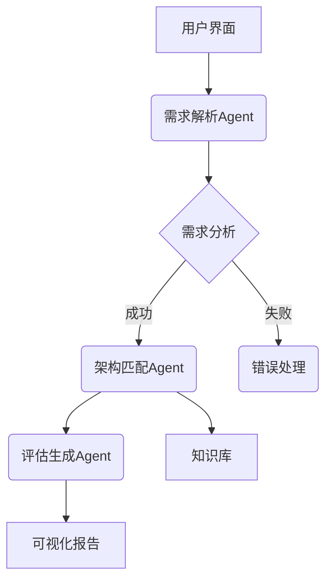
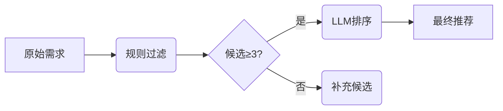

# 软件架构智能助手项目文档

## 项目概述
一个基于大语言模型的架构设计辅助系统，结合智能体（Agent）和微服务技术，实现从需求分析到架构推荐的自动化决策支持。


## 核心功能
| 功能模块 | 技术实现 | 输出示例 |
|---------|---------|---------|
| 需求理解 | DeepSeek + 特征提取 | JSON特征描述 |
| 架构推荐 | 规则引擎 + LLM推理 | 推荐架构列表 |
| 评估生成 | 混合评估模型 | 评估报告 |
| 知识管理 | JSON知识图谱 | 架构属性库 |

## 系统架构


## 技术选型
| 组件 | 技术栈 | 版本 |
|------|--------|------|
| 微服务框架 | FastAPI | 0.68+ |
| LLM集成 | DeepSeek API | R1 |
| 智能体通信 | HTTP/Async | - |
| 数据验证 | Pydantic | 2.0+ |
| 知识存储 | JSON | - |

## 功能模块

### 1. 需求解析模块
```python
class RequirementAgent:
    async def analyze(text) -> FeatureSet:
        # 使用LLM提取特征
```

### 2. 架构知识库
```json
{
  "微服务架构": {
    "适用场景": ["高并发", "复杂系统"],
    "技术栈": ["Spring Cloud", "Docker"],
    "复杂度": "高"
  }
}
```

### 3. 混合推荐引擎


## 代码结构
```
project-root/
├── config/
│   └── settings.py       # 配置管理
├── src/
│   ├── agents/          # 智能体实现
│   ├── clients/         # LLM客户端
│   ├── models/          # 数据模型
│   └── services/        # 服务集成
└── docs/
    └── architecture.md  # 架构文档
```

## 核心类说明

### DeepSeekClient
```python
class DeepSeekClient:
    async def generate_completion(prompt) -> str:
        # 实现API调用和重试机制
```

### ArchitectureAgent
```python
class ArchitectureAgent:
    async def recommend(features) -> Recommendation:
        # 混合推荐逻辑
```

## 部署与运行

### 安装依赖
```bash
pip install -r requirements.txt
# 核心依赖：fastapi, httpx, pydantic
```

### 启动服务
```bash
uvicorn src.services.assistant_service:app --reload
```

### 测试请求
```bash
curl -X POST "http://localhost:8000/recommend" \
-H "Content-Type: application/json" \
-d '{"text":"需要开发高并发电商平台"}'
```

## 示例用例

### 输入
```json
{
  "text": "开发跨平台即时通讯系统，支持万人同时在线"
}
```

### 输出
```json
{
  "recommendation": {
    "final_recommendation": "事件驱动架构",
    "reasoning": "适合高并发场景..."
  },
  "evaluation": {
    "overall_score": 8.5,
    "risks": {"运维复杂度": "高"}
  }
}
```

## 扩展与优化

1. **知识图谱升级**
   - 迁移到Neo4j图数据库
   - 添加架构模式关联关系

2. **性能优化**
   - 添加LLM响应缓存
   - 实现异步批处理

3. **部署增强**
   ```mermaid
   graph TD
     A[Docker容器] --> B{Kubernetes集群}
     B --> C[自动扩缩容]
     C --> D[监控告警]
   ```

## 注意事项

1. API密钥需配置在`.env`文件
2. 知识库路径需正确设置
3. 建议生产环境启用HTTPS

> 项目源码：https://github.com/example/arch-assistant  
> 在线演示：https://demo.example.com