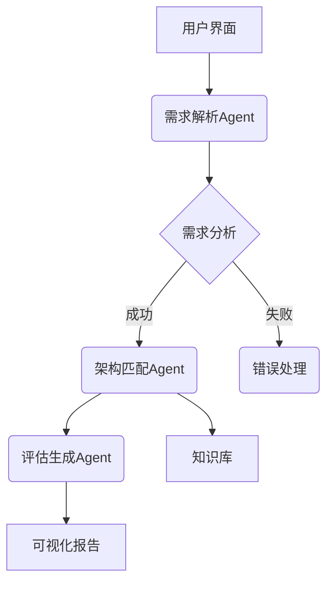
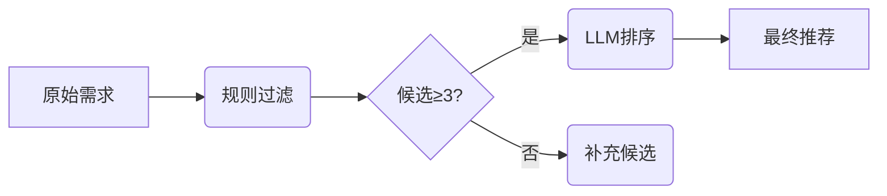

# 软件架构智能助手项目文档
[](https://opensource.org/licenses/Apache-2.0)
[](https://www.python.org/downloads/)

## 项目概述
一个基于大语言模型的架构设计辅助系统，结合智能体（Agent）和微服务技术，实现从需求分析到架构推荐的自动化决策支持。


## 核心功能
| 功能模块 | 技术实现 | 输出示例 |
|---------|---------|---------|
| 需求理解 | DeepSeek + 特征提取 | JSON特征描述 |
| 架构推荐 | 规则引擎 + LLM推理 | 推荐架构列表 |
| 评估生成 | 混合评估模型 | 评估报告 |
| 知识管理 | JSON知识图谱 | 架构属性库 |

## 🛠️ 快速开始

### 环境要求
- Python 3.10+
- DeepSeek API密钥

### 安装步骤
```bash
# 克隆仓库
git clone https://github.com/SoftwArch/ai-architecture-recommender.git
cd ai-architecture-recommender

# 创建虚拟环境(可选)
python -m venv venv
source venv/bin/activate

# 安装依赖
pip install -r requirements.txt

# 配置环境变量
cp .env.example .env

# 编辑 config/settings.py 文件填写API密钥
```

### 服务启动
```bash
# 开发模式（热重载）
uvicorn main:app --reload

# 生产模式
gunicorn -w 4 -k uvicorn.workers.UvicornWorker main:app
```
### 接口测试
```bash
# 请求示例
POST /api/v1/recommend HTTP/1.1
Content-Type: application/json

{
    "description": "需要支持百万级用户的即时通讯系统",
    "user_level": "expert"
}
```
```json
# 返回
{
    "status": "success",
    "data": {
        "analysis": {
            "key_features": [
                "支持百万级用户同时在线",
                "即时消息传递",
                "用户身份验证与授权",
                "消息存储与历史记录查询",
                "多设备同步",
                "群组聊天功能",
                "消息加密与安全传输",
                "在线状态管理",
                "消息推送通知",
                "高可用性与容错机制"
            ],
            "non_functional_requirements": {
                "性能": "系统需在毫秒级延迟内完成消息传递",
                "可扩展性": "支持水平扩展以应对用户增长",
                "可靠性": "确保消息不丢失且按序传递",
                "安全性": "端到端加密，防止数据泄露",
                "可用性": "99.9%以上的系统可用性",
                "可维护性": "模块化设计，便于更新和维护",
                "兼容性": "支持多种操作系统和设备"
            },
            "constraints": [
                "必须遵守数据隐私法规（如GDPR）",
                "系统需在现有云基础设施上运行",
                "开发周期不超过12个月",
                "预算限制在指定范围内",
                "必须支持主流移动和桌面平台"
            ],
            "analysis_summary": "该需求描述了一个高并发的即时通讯系统，核心挑战在于处理百万级用户的实时交互。关键特征需涵盖基础通讯功能与扩展能力，非功能性需求需重点关注性能、安全性和可靠性。约束条件涉及法律、时间和资源限制，需在架构设计中综合考虑。建议采用微服务架构实现模块化扩展，并引入消息队列和分布式数据库应对高负载。"
        },
        "recommendation": {
            "recommended_styles": [
                "微服务架构",
                "事件驱动架构",
                "分层架构"
            ],
            "comparison_matrix": {
                "微服务架构": {
                    "适用场景": [
                        "高并发",
                        "复杂系统"
                    ],
                    "优点": [
                        "模块解耦",
                        "独立部署",
                        "水平扩展"
                    ],
                    "缺点": [
                        "分布式复杂性",
                        "运维成本高"
                    ],
                    "匹配需求": [
                        "支持百万级用户同时在线",
                        "即时消息传递",
                        "高可用性与容错机制",
                        "可扩展性"
                    ]
                },
                "事件驱动架构": {
                    "适用场景": [
                        "实时系统",
                        "异步处理"
                    ],
                    "优点": [
                        "高吞吐量",
                        "松耦合",
                        "实时响应"
                    ],
                    "缺点": [
                        "调试复杂",
                        "消息顺序保证难"
                    ],
                    "匹配需求": [
                        "即时消息传递",
                        "消息推送通知",
                        "在线状态管理",
                        "性能"
                    ]
                },
                "分层架构": {
                    "适用场景": [
                        "企业级应用",
                        "清晰边界划分"
                    ],
                    "优点": [
                        "易于维护",
                        "职责分离",
                        "技术栈灵活"
                    ],
                    "缺点": [
                        "性能开销",
                        "跨层调用复杂"
                    ],
                    "匹配需求": [
                        "用户身份验证与授权",
                        "消息存储与历史记录查询",
                        "可维护性",
                        "兼容性"
                    ]
                }
            },
            "final_recommendation": "微服务架构",
            "reasoning": "1. 微服务架构完美匹配核心需求：通过模块化解耦实现即时通讯功能独立部署（如消息服务/认证服务），支持水平扩展应对百万级并发；2. 结合事件驱动模式补充实时消息处理能力，通过异步消息队列保证高吞吐；3. 分层架构可作为辅助设计模式组织代码结构。该组合满足所有关键约束：云原生部署、12个月开发周期内可实现的模块化设计，且符合GDPR的数据隔离要求。"
        },
        "evaluation": {
            "overall_score": 8.7,
            "metrics": [
                "可扩展性",
                "实时性",
                "合规性"
            ],
            "strengths": [
                "模块化解耦支持独立部署和水平扩展",
                "事件驱动模式增强实时消息处理能力"
            ],
            "weaknesses": [
                "微服务间通信可能引入延迟",
                "分布式系统调试和监控复杂度高"
            ],
            "improvement_suggestions": [
                "引入服务网格(如Istio)优化服务间通信",
                "实施分布式追踪系统(如Jaeger)",
                "增加消息队列的灾备方案设计"
            ],
            "risk_assessment": {
                "数据一致性风险": "中等",
                "运维复杂度风险": "高",
                "技术栈成熟度风险": "低"
            }
        }
    },
    "meta": {
        "user_level": "expert"
    }
}
```

## 文档目录
1. [架构设计文档](docs/架构设计文档.md) 
2. [系统测试报告](docs/系统测试报告.md)
3. [需求规格说明书](docs/需求规格说明书.md)

## 系统架构


## 技术选型
| 组件 | 技术栈 | 版本 |
|------|--------|------|
| 微服务框架 | FastAPI | 0.68+ |
| LLM集成 | DeepSeek API | R1 |
| 智能体通信 | HTTP/Async | - |
| 数据验证 | Pydantic | 2.0+ |
| 知识存储 | JSON | - |

## 功能模块

### 1. 需求解析模块
```python
class RequirementAgent:
    async def analyze(text) -> FeatureSet:
        # 使用LLM提取特征
```

### 2. 架构知识库
```json
{
  "微服务架构": {
    "适用场景": ["高并发", "复杂系统"],
    "技术栈": ["Spring Cloud", "Docker"],
    "复杂度": "高"
  }
}
```

### 3. 混合推荐引擎


## 代码结构
```
project-root/
├── config/
│   └── settings.py       # 配置管理
├── src/
│   ├── agents/          # 智能体实现
│   ├── clients/         # LLM客户端
│   ├── models/          # 数据模型
│   └── services/        # 服务集成
└── docs/
    └── architecture.md  # 架构文档
```

## 核心类说明

### DeepSeekClient
```python
class DeepSeekClient:
    async def generate_completion(prompt) -> str:
        # 实现API调用和重试机制
```

### ArchitectureAgent
```python
class ArchitectureAgent:
    async def recommend(features) -> Recommendation:
        # 混合推荐逻辑
```


## 扩展与优化

1. **知识图谱升级**
   - 迁移到Neo4j图数据库
   - 添加架构模式关联关系

2. **性能优化**
   - 添加LLM响应缓存
   - 实现异步批处理

3. **部署增强**
   ```mermaid
   graph TD
     A[Docker容器] --> B{Kubernetes集群}
     B --> C[自动扩缩容]
     C --> D[监控告警]
   ```

## 注意事项

1. API密钥需配置在`setting.py`文件
2. 知识库路径需正确设置
3. 建议生产环境启用HTTPS

> 项目源码：https://github.com/example/arch-assistant  
> 在线演示：https://demo.example.com