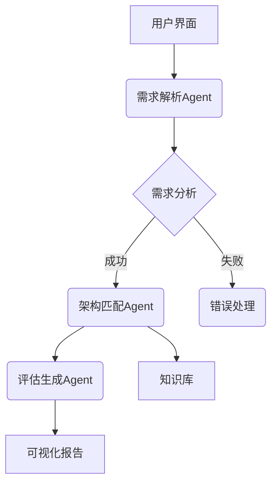

# 软件架构智能助手项目文档
[](https://opensource.org/licenses/Apache-2.0)
[](https://www.python.org/downloads/)

## 项目概述
一个基于大语言模型的架构设计辅助系统，结合智能体（Agent）和微服务技术，实现从需求分析到架构推荐的自动化决策支持。

## 核心功能
| 功能模块 | 技术实现 | 输出示例 |
|---------|---------|---------|
| 需求理解 | DeepSeek + 特征提取 | JSON特征描述 |
| 架构推荐 | 规则引擎 + LLM推理 | 推荐架构列表 |
| 评估生成 | 混合评估模型 | 评估报告 |
| 知识管理 | JSON知识图谱 | 架构属性库 |

## 🛠️ 快速开始

### 环境要求
- Python 3.10+
- DeepSeek API密钥

### 安装步骤
```bash
# 克隆仓库
git clone https://github.com/SoftwArch/ai-architecture-recommender.git
cd ai-architecture-recommender

# 创建虚拟环境(可选)
python -m venv venv
source venv/bin/activate

# 安装依赖
pip install -r requirements.txt

# 配置环境变量
cp .env.example .env

# 编辑 config/settings.py 文件填写API密钥
```

### 服务启动
```bash
# 开发模式（热重载）
uvicorn main:app --reload

# 生产模式
gunicorn -w 4 -k uvicorn.workers.UvicornWorker main:app
```
### 接口测试
```bash
# 请求示例
POST /api/v1/recommend HTTP/1.1
Content-Type: application/json

{
    "description": "需要支持百万级用户的即时通讯系统",
    "user_level": "expert"
}
```

## 文档目录
1. [架构设计文档](docs/架构设计文档.md) 
2. [系统测试报告](docs/系统测试报告.md)
3. [需求规格说明书](docs/需求规格说明书.md)

## 系统架构


## 技术选型
| 组件 | 技术栈 | 版本 |
|------|--------|------|
| 微服务框架 | FastAPI | 0.68+ |
| LLM集成 | DeepSeek API | R1 |
| 智能体通信 | HTTP/Async | - |
| 数据验证 | Pydantic | 2.0+ |
| 知识存储 | JSON | - |

## 功能模块

### 1. 需求解析模块
```python
class RequirementAgent:
    async def analyze(text) -> FeatureSet:
        # 使用LLM提取特征
```

### 2. 架构知识库
```json
{
  "微服务架构": {
    "适用场景": ["高并发", "复杂系统"],
    "技术栈": ["Spring Cloud", "Docker"],
    "复杂度": "高"
  }
}
```

## 代码结构
```
project-root/
├── config/
│   └── settings.py       # 配置管理
├── src/
│   ├── agents/          # 智能体实现
│   ├── clients/         # LLM客户端
│   ├── models/          # 数据模型
│   └── services/        # 服务集成
├── models/              # agents输出模式
└── docs/                # 文档
```

## 核心类说明

### DeepSeekClient
```python
class DeepSeekClient:
    async def generate_completion(prompt) -> str:
        # 实现API调用和重试机制
```

### ArchitectureAgent
```python
class ArchitectureAgent:
    async def recommend(features) -> Recommendation:
        # 混合推荐逻辑
```

## 注意事项

1. API密钥需配置在`setting.py`文件
2. 知识库路径需正确设置
3. 建议生产环境启用HTTPS