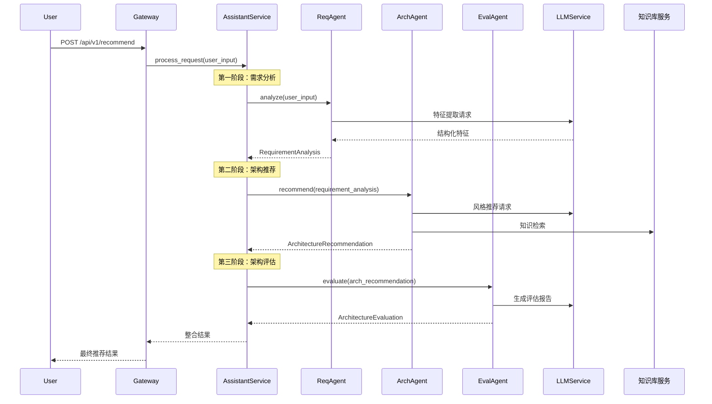

# 软件架构智能助手架构设计文档

## 1. 系统概述

本系统是一个基于大模型的软件架构智能助手，采用微服务架构设计，通过多个智能体的协作来提供软件架构推荐服务。系统使用 FastAPI 框架构建，集成了 DeepSeek 等 LLM 模型，实现了需求分析、架构推荐和评估等功能。

## 2. 微服务划分

系统采用模块化的微服务架构，主要包含以下核心服务：

### 2.1 API 网关服务
- 位置：`main.py`
- 职责：
  - 提供统一的 API 入口
  - 处理 CORS 跨域请求
  - 路由请求到相应的服务
  - 提供健康检查接口
- 主要接口：
  - `/api/v1/recommend`：架构推荐接口
  - `/api/v1/architecture/detail`：架构详情查询接口
  - `/health`：健康检查接口

### 2.2 助手服务（Assistant Service）
- 位置：`src/services/assistant_service.py`
- 职责：
  - 协调各个智能体的工作
  - 处理用户请求
  - 管理架构知识库
  - 生成最终推荐结果

### 2.3 LLM 服务
- 位置：`src/llm_client.py`
- 职责：
  - 封装 DeepSeek API 调用
  - 提供统一的 LLM 接口
  - 支持多种 LLM 模型
- 主要功能：
  - 需求分析
  - 架构推荐
  - 架构评估

## 3. 智能体协作机制

系统采用基于智能体的协作模式，主要包含以下智能体：

### 3.1 需求解析智能体（ReqAgent）
- 功能：分析用户输入的自然语言需求
- 输出：
  - 关键特征列表
  - 非功能性需求
  - 约束条件
  - 分析总结
- 交互流程：
  - 接收用户请求
  - 调用 LLM 服务进行特征提取
  - 发布架构匹配事件

### 3.2 架构匹配智能体（ArchAgent）
- 功能：基于需求分析结果推荐合适的架构风格
- 输出：
  - 推荐的架构风格列表
  - 架构风格比较矩阵
  - 最终推荐方案
  - 推荐理由
- 交互流程：
  - 接收需求解析结果
  - 调用 LLM 服务进行风格推荐
  - 查询知识库服务
  - 返回候选架构列表

### 3.3 评估生成智能体（EvalAgent）
- 功能：评估推荐的架构方案
- 输出：
  - 总体评分
  - 评估指标
  - 优势和劣势分析
  - 改进建议
  - 风险评估
- 交互流程：
  - 接收架构推荐结果
  - 调用 LLM 服务生成评估报告
  - 返回最终评估结果

### 3.4 智能体协作流程


## 4. LLM 集成方案

### 4.1 LLM 客户端设计
- 采用工厂模式设计
- 支持多种 LLM 模型
- 提供统一的接口抽象

### 4.2 核心功能
```python
class BaseLLMClient(ABC):
    async def generate_completion(self, prompt: str, temperature: float = 0.7) -> str
    async def analyze_requirements(self, description: str) -> Dict[str, Any]
    async def recommend_architecture(self, requirements: Dict[str, Any]) -> Dict[str, Any]
    async def evaluate_architecture(self, architecture: Dict[str, Any]) -> Dict[str, Any]
```

### 4.3 Prompt 工程
- 需求分析 Prompt：
  - 提取关键特征
  - 识别非功能性需求
  - 分析约束条件

- 架构推荐 Prompt：
  - 生成架构风格推荐
  - 创建比较矩阵
  - 提供推荐理由

- 架构评估 Prompt：
  - 生成评估指标
  - 分析优劣势
  - 提供改进建议

## 5. 系统特点

1. **模块化设计**：
   - 服务间低耦合
   - 易于扩展和维护
   - 支持独立部署

2. **智能体协作**：
   - 职责明确
   - 流程清晰
   - 结果可追踪

3. **LLM 集成**：
   - 统一的接口抽象
   - 灵活的模型切换
   - 可控的输出质量

4. **可扩展性**：
   - 支持添加新的智能体
   - 支持集成新的 LLM 模型
   - 支持扩展新的功能模块
