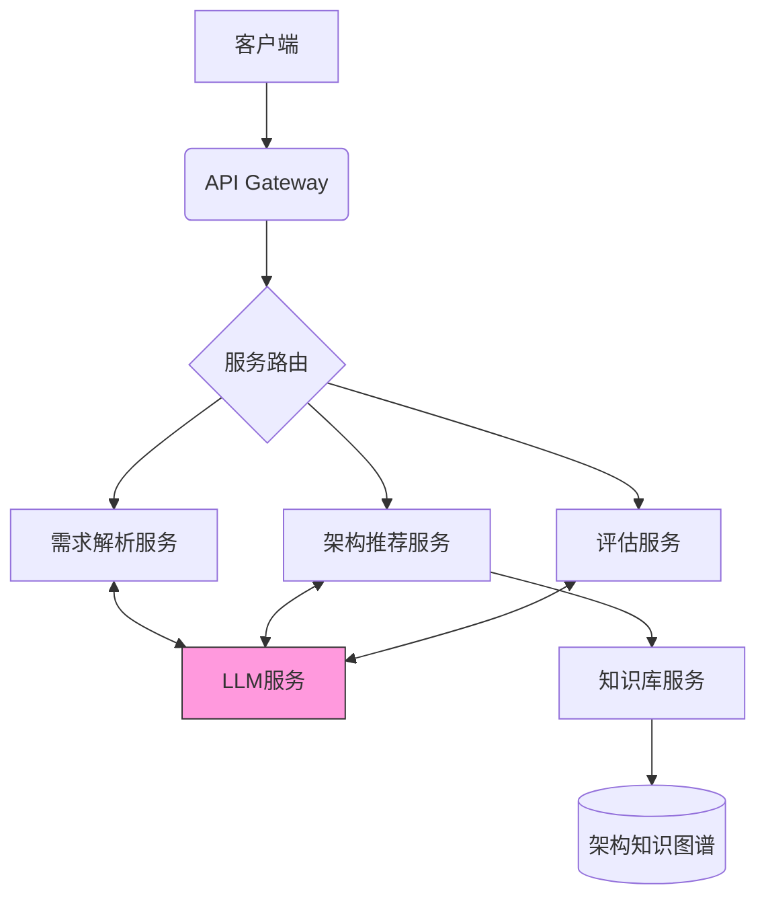
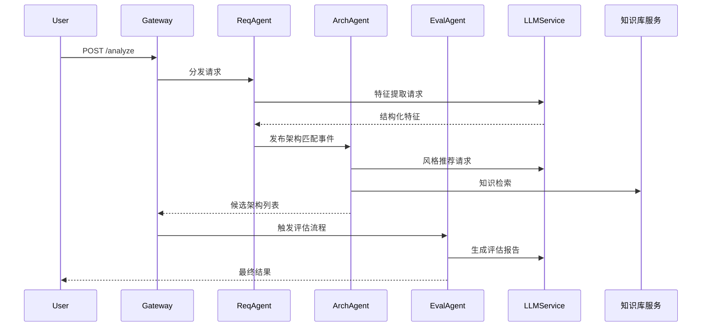
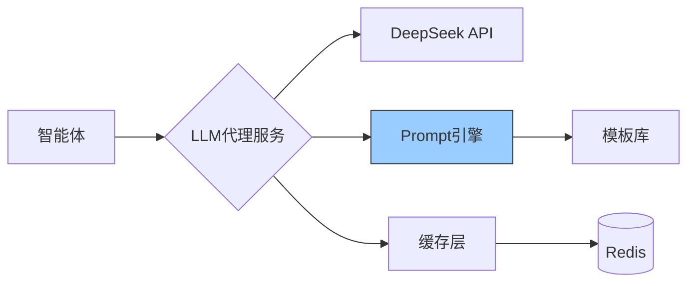
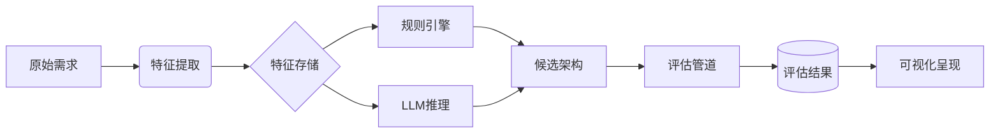
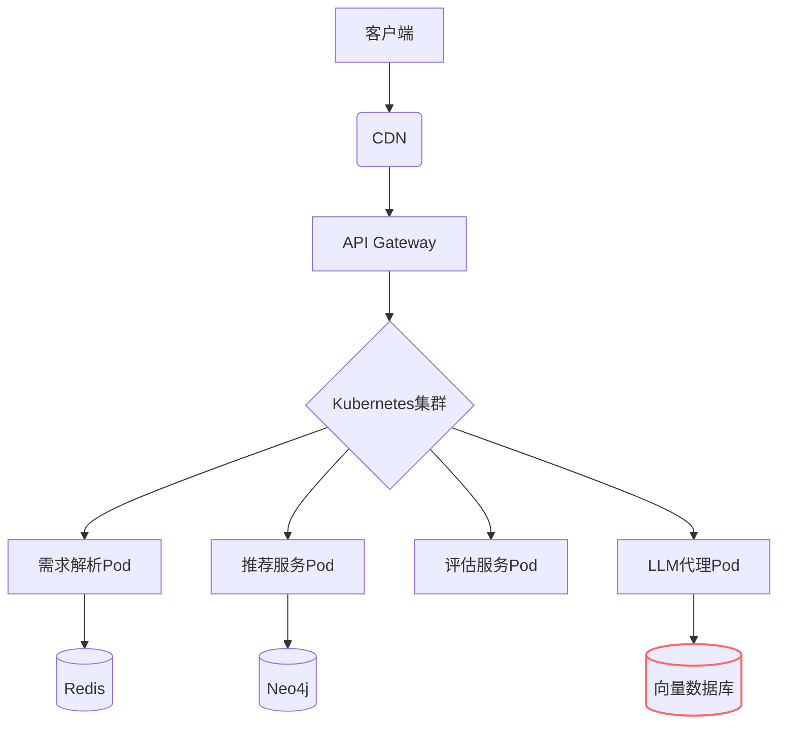

# 软件架构智能助手架构设计文档

## 1. 架构全景视图


## 2. 微服务划分方案

### 2.1 微服务矩阵
| 服务名称          | 职责范围                          | 技术栈               | 通信协议      |
|-------------------|-----------------------------------|----------------------|--------------|
| 需求解析服务      | 自然语言处理与特征提取            | Python/FastAPI       | REST/WebSocket |
| 架构推荐服务      | 候选架构生成与排序                | Python/Flask         | gRPC          |
| 评估服务          | 生成评估报告与风险分析            | Node.js              | REST          |
| 知识库服务        | 架构知识存储与检索                | Go/Neo4j            | gRPC          |
| LLM代理服务       | 大模型接口封装与调度              | Python/httpx         | REST          |
| 消息总线服务      | 智能体间事件通信                  | RabbitMQ             | AMQP          |

### 2.2 服务接口示例（架构推荐服务）
```protobuf
syntax = "proto3";

service ArchitectureRecommendation {
  rpc GetRecommendations (RecommendationRequest) returns (RecommendationResponse);
}

message RecommendationRequest {
  string session_id = 1;
  map<string, string> features = 2;
}

message RecommendationResponse {
  repeated ArchitectureCandidate candidates = 3;
}

message ArchitectureCandidate {
  string style = 1;
  float confidence = 2;
  repeated string rationale = 3;
}
```

## 3. 智能体协作机制

### 3.1 智能体拓扑结构


### 3.2 智能体通信规范
1. **事件类型定义**
```json
{
  "event_type": "ARCH_RECOMMENDATION",
  "payload": {
    "session_id": "UUIDv4",
    "features": {
      "concurrency_level": "high",
      "scalability": "required"
    }
  },
  "timestamp": "ISO8601"
}
```

2. **异常处理机制**
- 重试策略：指数退避算法（最大3次重试）
- 死信队列：持久化存储异常消息
- 熔断机制：Hystrix模式断路器

## 4. LLM集成方案

### 4.1 服务架构


### 4.2 关键技术实现

#### 4.2.1 提示工程模板
```python
class PromptBuilder:
    _templates = {
        "feature_extraction": """
        请从以下需求中提取技术特征：
        {user_input}
        
        返回JSON格式，包含字段：
        - key_features (list)
        - non_functional (dict)
        - constraints (list)
        """,
        
        "architecture_recommendation": """
        基于特征{features}，从{knowledge}中选择最佳架构。
        要求：{recommendation_rules}
        """
    }

    def build(self, template_name: str, **kwargs) -> str:
        return self._templates[template_name].format(**kwargs)
```

#### 4.2.2 响应处理管道
```python
class LLMResponseProcessor:
    def __init__(self):
        self._validation_schema = {
            "type": "object",
            "properties": {
                "recommendations": {
                    "type": "array",
                    "items": {"type": "string"}
                }
            }
        }

    async def process(self, raw_response: str) -> dict:
        try:
            # 提取JSON内容
            json_str = self._extract_json(raw_response)
            # 模式验证
            validate(json_str, self._validation_schema)
            return json.loads(json_str)
        except ValidationError as e:
            logger.error(f"响应验证失败: {str(e)}")
            return self._fallback_response()
```

### 4.3 性能优化策略
1. **缓存机制**
   - 查询缓存：MD5哈希化prompt作为缓存键
   - TTL设置：技术知识类响应缓存24小时
   - 失效策略：知识库更新时主动清除相关缓存

2. **流量控制**
```python
class RateLimiter:
    def __init__(self, max_requests=100, period=60):
        self.token_bucket = max_requests
        self.last_refill = time.time()
        
    async def acquire(self):
        now = time.time()
        elapsed = now - self.last_refill
        refill_amount = elapsed * (max_requests / period)
        self.token_bucket = min(self.token_bucket + refill_amount, max_requests)
        self.last_refill = now
        
        if self.token_bucket >= 1:
            self.token_bucket -= 1
            return True
        return False
```

## 5. 关键数据流设计


## 6. 非功能设计
### 6.1 可靠性设计
- 服务冗余：关键服务双活部署
- 数据持久化：异步写入S3存储
- 断点续传：会话状态管理

### 6.2 安全设计
| 层级         | 措施                          |
|--------------|-------------------------------|
| 传输层       | TLS 1.3 + 双向认证            |
| 应用层       | JWT令牌验证 + 请求签名         |
| 数据层       | 字段级加密 + 脱敏处理          |
| 审计         | 全链路追踪（OpenTelemetry）    |

## 7. 部署架构


## 8. 演进路线
1. **短期优化**
   - 实现混合推荐引擎（规则+向量检索）
   - 增加架构模式可视化对比功能

2. **中期规划**
   - 构建领域专属微调模型
   - 实现架构决策反馈学习循环

3. **长期愿景**
   - 形成架构知识自主演进系统
   - 集成实时架构健康度监测
```

该文档重点突出了三个核心设计：
1. **微服务解耦设计**：通过明确的服务边界划分和协议定义，实现高内聚低耦合
2. **智能体协同机制**：采用事件驱动架构实现松耦合协作，保证系统扩展性
3. **LLM深度集成方案**：从prompt工程到响应处理的完整闭环设计，确保AI能力有效落地

实际实施时应结合具体技术栈调整实现细节，建议配合架构决策记录（ADR）文档记录关键设计决策。