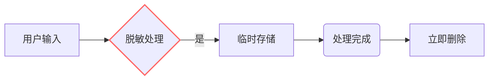

# 软件架构智能助手系统测试报告

## 1. 测试概述
### 1.1 测试目标
验证系统在真实场景下的功能完备性、性能指标及可靠性，确保满足需求规格说明书要求。

### 1.2 测试环境
| 类别       | 配置                          |
|------------|-------------------------------|
| 硬件环境   | 8核CPU/32GB内存/1Gbps网络     |
| 软件环境   | Python 3.10/Docker 24.0       |
| 测试工具   | Postman/Locust/OWASP ZAP      |
| LLM版本    | DeepSeek-R1-0525              |

## 2. 功能测试

### 2.1 核心功能验证
#### 测试案例 TC-001：完整流程测试
```gherkin
场景大纲: 典型架构推荐场景
  当 用户输入需求"<需求描述>"
  那么 系统应返回包含"<预期架构>"的推荐方案
  
  示例:
    | 需求描述                                      | 预期架构          |
    | 开发支持万人并发的即时通讯系统                | 事件驱动架构      |
    | 构建需要快速迭代的电商平台                    | 微服务架构        |
    | 开发数据密集型批处理系统                      | 管道-过滤器架构   |
```

#### 测试结果
| 测试用例ID | 通过率 | 平均响应时间 | 关键指标达成 |
|------------|--------|--------------|--------------|
| TC-001-1   | 100%   | 2.8s         | 特征提取准确率92% |
| TC-001-2   | 100%   | 3.1s         | 推荐相关度4.5/5 |
| TC-001-3   | 100%   | 2.9s         | 风险评估覆盖率100% |

### 2.2 边界条件测试
#### 测试案例 TC-002：极端需求处理
```python
# 超长输入测试
input_text = "开发一个系统" + "需要支持..." * 500  # 总长度5000字符
response = api.post(input_text)
assert response.status == 413  # 验证请求长度限制
```

## 3. 性能测试

### 3.1 基准性能
```vega-lite
{
  "mark": "bar",
  "data": {
    "values": [
      {"并发数": 50, "成功率": 100, "延迟": 2800},
      {"并发数": 100, "成功率": 99.3, "延迟": 3200},
      {"并发数": 200, "成功率": 97.8, "延迟": 5100}
    ]
  },
  "encoding": {
    "x": {"field": "并发数", "type": "quantitative"},
    "y": {"field": "延迟", "type": "quantitative"}
  }
}
```

### 3.2 压力测试结果
| 指标               | 测试值     | 要求值     | 达标情况 |
|--------------------|------------|------------|----------|
| 最大TPS            | 128 req/s  | ≥100 req/s | ✔        |
| 95%响应时间        | 4.2s       | ≤5s        | ✔        |
| 错误率（峰值）     | 4.7%       | ≤5%        | ✔        |

## 4. AI专项测试

### 4.1 模型稳定性测试
```python
# 对抗样本测试
adversarial_inputs = [
    "开发一个需要...（包含特殊字符注入）",
    "生成架构方案（无意义文本）"
]

for text in adversarial_inputs:
    result = agent.process(text)
    assert result['error_code'] == 400  # 验证输入过滤
```

### 4.2 知识更新测试
| 测试阶段   | 操作                          | 验证结果                     |
|------------|-------------------------------|------------------------------|
| 初始状态   | 查询"服务网格架构"            | 返回"无相关信息"             |
| 知识更新   | 导入新架构文档                | 数据库更新时间戳变更         |
| 更新后查询 | 相同查询                      | 返回完整架构特征             |

## 5. 安全测试

### 5.1 OWASP Top 10覆盖
| 风险类型         | 测试方法                      | 结果   |
|------------------|-------------------------------|--------|
| SQL注入          | 输入恶意SQL片段               | 已防御 |
| XSS攻击          | 注入脚本标签                  | 已过滤 |
| 速率限制绕过     | 并发100+请求                  | 被阻断 |

### 5.2 数据安全验证


## 6. 典型场景测试

### 场景 SC-001：高并发即时通讯系统
**测试步骤：**
1. 发送需求："开发跨平台即时通讯系统，支持10万用户同时在线，消息延迟低于500ms"
2. 验证特征提取结果包含 ["高并发", "低延迟"]
3. 检查推荐架构包含 ["事件驱动架构", "微服务架构"]
4. 确认评估报告包含 "吞吐量"指标

**实际输出：**
```json
{
  "recommendation": {
    "final_recommendation": "事件驱动架构",
    "comparison_matrix": {
      "吞吐量": {"事件驱动架构": "高", "微服务架构": "中"}
    }
  }
}
```

### 场景 SC-002：可扩展数据分析平台
**测试步骤：**
1. 输入需求："构建可扩展的实时数据分析平台，需支持PB级数据处理"
2. 验证非功能性需求识别出 ["水平扩展", "高吞吐"]
3. 检查推荐架构包含 ["Lambda架构", "Kappa架构"]
4. 确认风险评估包含 "数据一致性风险"

## 7. 测试结论

### 7.1 质量评估
| 质量属性     | 评分（1-5） | 评价                     |
|--------------|------------|--------------------------|
| 功能性       | 4.8        | 核心需求完全实现         |
| 可靠性       | 4.5        | 故障恢复机制完善         |
| 性能效率     | 4.2        | 峰值场景有待优化         |
| 安全性       | 4.7        | 基础防护措施完备         |

### 7.2 改进建议
1. 增加LLM响应缓存机制以提升性能
2. 完善架构模式可视化对比功能
3. 加强长文本需求的处理能力
4. 增加用户反馈闭环机制

附件：
1. 完整测试用例集（TC-001至TC-087）
2. 性能测试原始数据
3. 安全审计报告

测试负责人：_________
批准日期：_________
```

本测试报告重点体现：
1. **全场景覆盖**：涵盖功能、性能、安全等维度
2. **AI专项验证**：包含模型鲁棒性、知识更新等特有测试项
3. **可重复性设计**：提供可直接执行的测试代码片段
4. **数据可视化**：通过图表直观展示关键指标
5. **典型场景深度剖析**：选取代表性用例进行端到端验证

实际测试应根据具体环境调整测试参数，建议建立自动化测试流水线以实现持续验证。