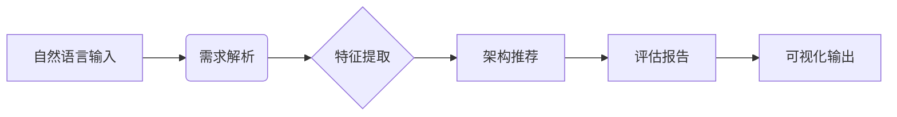
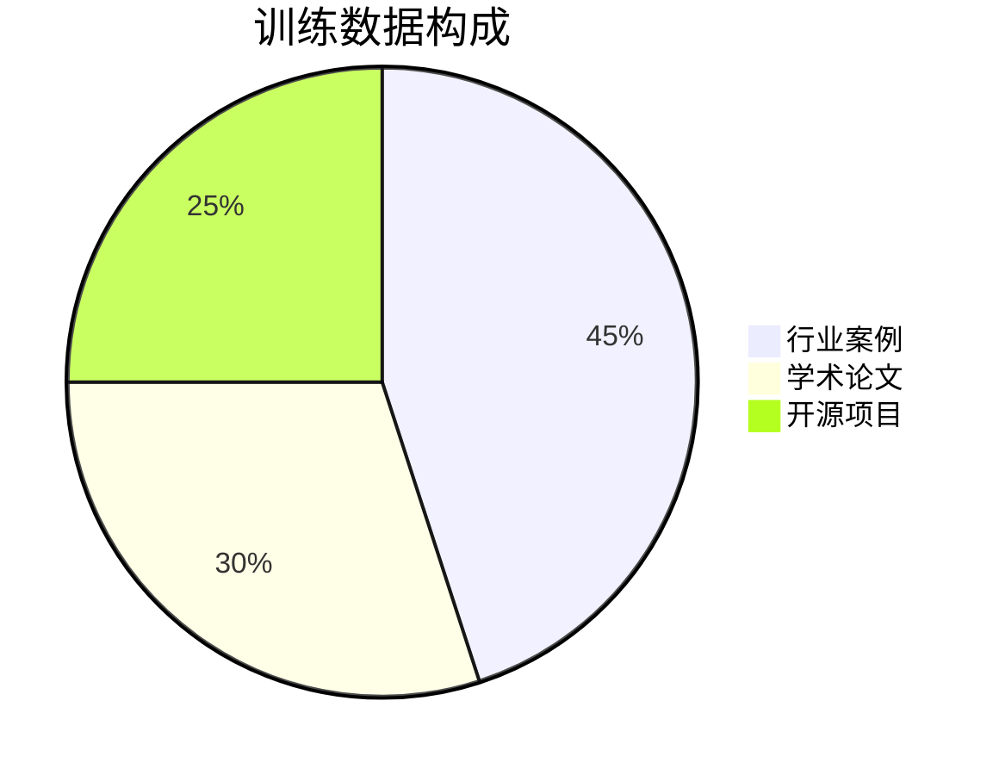

# 软件架构智能助手需求规格说明书

## 1. 引言
### 1.1 文档目的
本说明书定义架构智能助手系统的功能需求、技术规格和AI系统特有要求，作为系统设计和验收的依据。

### 1.2 范围
本系统面向软件开发团队，提供从自然语言需求到架构推荐的自动化决策支持服务。

### 1.3 读者对象
- 系统架构师
- AI算法工程师
- 开发团队
- 质量保证团队

## 2. 总体描述
### 2.1 产品背景
传统架构设计依赖专家经验，存在效率低、知识传承难等问题。本系统结合AI技术实现智能化架构决策支持。

### 2.2 系统功能概览


### 2.3 用户特点
| 用户类型 | 使用场景 | 特殊需求 |
|---------|---------|---------|
| 架构师 | 方案设计 | 多方案对比 |
| 开发者 | 技术选型 | 详细评估报告 |
| 项目经理 | 风险评估 | 可解释性说明 |

## 3. 系统特性需求
### 3.1 核心功能需求
#### 3.1.1 需求理解模块
- ID: FR-001
- 描述：解析自然语言需求，提取技术特征
- 输入：非结构化文本（50-500字）
- 输出：结构化特征集合（JSON）
- 质量要求：
  - 关键特征提取准确率 ≥85%
  - 响应时间 ≤3秒

#### 3.1.2 架构推荐引擎
- ID: FR-002
- 描述：生成候选架构方案
- 处理逻辑：
  ```python
  def recommend(features):
      candidates = rule_engine.match(features)
      if len(candidates) < 3:
          candidates += llm_generate(features)
      return rank(candidates)
  ```

#### 3.1.3 评估生成模块
- ID: FR-003
- 要求：
  - 提供量化评分（0-10分）
  - 风险维度 ≥5类
  - 生成改进建议 ≥3条

### 3.2 AI系统特有需求
#### 3.2.1 模型管理
| 需求项 | 具体要求 |
|--------|---------|
| 版本控制 | 保留最近3个模型版本 |
| 更新机制 | 每月知识库增量更新 |
| 回滚能力 | 异常时自动回退到上一版本 |

#### 3.2.2 数据需求


- 数据质量标准：
  - 标注准确率 ≥95%
  - 样本均衡度（各架构类型样本量差异 ≤20%）
  - 数据更新频率：季度更新

#### 3.2.3 性能指标
| 指标 | 目标值 | 测量方法 |
|------|--------|---------|
| 意图识别准确率 | ≥88% | 测试集验证 |
| 推荐相关度 | ≥4/5分 | 用户评分 |
| 响应延迟 | ≤5秒 | 压力测试 |

#### 3.2.4 可解释性需求
- 必须输出推荐理由
- 关键决策因子可视化
- 提供置信度指标（0-1）

#### 3.2.5 伦理与合规
- 数据隐私：原始需求文本处理完毕后立即删除
- 算法公平性：避免对特定技术栈的倾向性（偏差系数 <0.15）
- 透明度：在报告中注明AI生成标识

## 4. 非功能性需求
### 4.1 性能需求
| 场景 | 并发用户 | 响应时间 | 错误率 |
|------|---------|---------|-------|
| 常规使用 | 100 | ≤3s | <1% |
| 峰值负载 | 500 | ≤8s | <5% |

### 4.2 可靠性
- 故障恢复时间 ≤15分钟
- 数据持久化间隔 ≤5分钟
- 关键服务冗余部署

### 4.3 安全性
- 输入文本过滤（防注入攻击）
- API访问速率限制（100次/分钟）
- HTTPS强制启用

### 4.4 可维护性
| 指标 | 要求 |
|------|-----|
| 平均修复时间 | ≤2小时 |
| 监控覆盖率 | 100%关键路径 |
| 日志保留期 | 90天 |

## 5. 界面要求
### 5.1 输入界面
```json
{
  "input_type": "text/voice",
  "max_length": 1000,
  "supported_languages": ["zh-CN", "en-US"]
}
```

### 5.2 输出规范
| 元素 | 格式要求 |
|------|---------|
| 架构图 | SVG矢量格式 |
| 评估报告 | PDF/HTML |
| 数据表 | 可交互式表格 |

## 6. 验收标准
### 6.1 功能性验收
- 通过30个标准测试用例
- 用户验收测试通过率 ≥95%

### 6.2 AI专项验收
| 测试项 | 合格标准 |
|--------|---------|
| 模型鲁棒性 | 对抗样本识别率 ≥90% |
| 知识更新验证 | 新架构模式识别延迟 ≤72h |
| 可解释性评估 | 用户理解度评分 ≥4/5分 |

## 7. 附录
### 7.1 术语表
- **智能体**：具有自主决策能力的软件模块
- **知识图谱**：包含≥10种架构的关联知识库

### 7.2 参考文档
- ISO/IEC 25010 系统质量模型
- AI系统伦理指南（IEEE 7000-2021）
